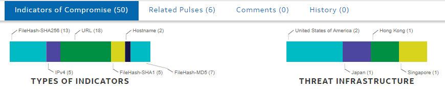

# ISAC

Les centres de partage et d'analyse de l'information (Information Sharing and Analysis Centers : ISAC) sont utilisés pour partager et échanger divers indicateurs de compromission (IOC) afin d'obtenir des renseignements sur les menaces. Les IOC peuvent inclure des MD5, des IP, des règles YARA, etc. Il existe de nombreux ISAC qui peuvent être utilisés pour recueillir des renseignements sur les menaces, notamment AlienVault OTX, Threat Connect et MISP.

## Terminologie

**APT** est un acronyme pour **Advanced Persistent Threat** (menace persistante avancée). Il peut s'agir d'une équipe ou d'un groupe (groupe de menace), voire d'un pays (**groupe d'État-nation**), qui se livre à des attaques à long terme contre des organisations et/ou des pays. Le terme "avancé" peut être trompeur car il tend à nous faire croire que chaque groupe APT dispose d'une super-arme, par exemple un exploit de type "zero-day", qu'il utilise. Or, ce n'est pas le cas. Comme nous le verrons un peu plus loin, les techniques utilisées par ces groupes APT sont assez courantes et peuvent être détectées avec les bonnes implémentations en place. Vous pouvez consulter la liste actuelle des groupes APT de FireEye [ici](https://www.fireeye.com/current-threats/apt-groups.html).  

**TTP** est un acronyme pour **Tactics, Techniques, and Procedures**, mais que signifie chacun de ces termes ?

*  La **tactique** est le but ou l'objectif de l'adversaire.
*  La **technique** est la manière dont l'adversaire atteint le but ou l'objectif.
*  La **procédure** est la façon dont la technique est exécutée.

**TI** est l'acronyme de **Threat Intelligence**. Le renseignement sur les menaces est un terme général qui désigne toutes les informations recueillies sur les adversaires et les TTP. Vous entendrez aussi couramment **CTI** ou **Cyber Threat Intelligence**, qui n'est qu'une autre façon de dire Threat Intelligence.

**IOC** est un acronyme pour **Indicators of Compromise**, les indicateurs de logiciels malveillants et de groupes d'adversaires. Les indicateurs peuvent être des hachages de fichiers, des adresses IP, des noms, etc.

## Threat Intelligence

Le TI ou encore le CTI est utilisé pour fournir des informations sur le paysage des menaces, en particulier sur les adversaires et leurs TTP. En général, le CTI concerne les groupes APT et/ou d'autres menaces, qu'il s'agisse de groupes connus ou de nouvelles menaces émergentes.

Les données doivent être analysées pour être considérées comme des renseignements sur les menaces. Une fois analysées et exploitables, elles deviennent des renseignements sur les menaces. Les données ont besoin d'un contexte pour devenir des renseignements.

La CTI est une mesure de précaution que les entreprises utilisent ou à laquelle elles contribuent afin que d'autres sociétés ne soient pas touchées par les mêmes attaques. Bien entendu, les adversaires changent leurs TTP en permanence, de sorte que le paysage de la TI est en constante évolution.

Les fournisseurs et les entreprises partagent parfois leurs CTI collectées dans ce que l'on appelle les ISAC (Information Sharing and Analysis Centers). Les ISAC recueillent divers indicateurs d'un adversaire que les autres entreprises peuvent utiliser à titre de précaution contre les adversaires.

Le renseignement sur les menaces se divise en trois types différents.

* Stratégique

	Aider la direction à prendre des décisions éclairées, notamment en ce qui concerne le budget et les stratégies de sécurité.

*  Tactique

	Interagit avec les TTP et les modèles d'attaque pour identifier les modèles d'attaque de l'adversaire.

*  Opérationnel

	Interagit avec les IOC et la manière dont les adversaires opèrent.

## Que sont les ISACs ?

Selon le National Council of ISACs, les ISAC sont des organisations dirigées par leurs membres, qui fournissent des informations sur les menaces et les mesures d'atténuation tous risques aux propriétaires et aux exploitants de biens". Les ISAC peuvent être axés sur la communauté ou sur un fournisseur en particulier. Les ISAC comprennent des informations sur les menaces provenant des acteurs de la menace ainsi que des informations sur les mesures d'atténuation sous forme d'IOC, de règles YARA, etc. Les ISACs maintiennent une connaissance de la situation en partageant et en collaborant pour maintenir la CTI, par le biais d'un Conseil national des ISACs.

Vous pouvez consulter la liste des membres ISACs ici : https://www.nationalisacs.org/member-isacs.

Nous nous concentrerons sur les ISAC en ce qui concerne la cybersécurité et le renseignement sur les cybermenaces ; toutefois, les ISAC peuvent être utilisés pour d'autres raisons que la cybersécurité.

Vous trouverez ci-dessous une liste des ISAC qui peuvent aider une équipe bleue. Nous n'en présenterons que quelques-uns dans cette salle.

*  US-CERT
*  AlienVault OTX
*  ThreatConnect
*  MISP

## AlienVault OTX

AlienVault OTX d'AT&T Cybersecurity est l'un des principaux ISAC qui sert d'échange de renseignements sur les menaces entretenus par la communauté.

Vous devrez créer un compte AlienVault avant de pouvoir utiliser pleinement l'application. Allez à https://otx.alienvault.com/ et créez un compte avant de continuer.

Alienvault utilise des "Pulses" pour créer des traqueurs pour diverses catégories. Les Pulses peuvent être classées par type de logiciel malveillant, par groupe ou APT, et par secteur d'activité ciblé. Toutes les Pulses sont créées par la communauté, à l'exception des Pulses officielles d'AlienVault.

Les Pulses peuvent inclure une grande variété d'IOC tels que les hachages de fichiers (MD5, SHA1), IPv4, IPv6, domaine, URL, YARA, CVE, etc.

La page principale d'OTX que vous utiliserez est le tableau de bord. Le tableau de bord par défaut comprend une visualisation des logiciels malveillants actifs les plus courants, ventilés par catégorie, ainsi qu'une liste des pulses souscrites. Par défaut, seules les pulses souscrites d'AlienVault sont listées. Cette liste peut être étendue ultérieurement.

Il y a également six onglets différents sur la barre de navigation, qui sont décrits ci-dessous.

*  Dashboard - Cet onglet est illustré dans la capture d'écran ci-dessus. Il s'agit de la page principale d'OTX, qui fournit un bref aperçu des informations importantes.
*  Browse - Cette fonction vous permet de voir toutes les nouvelles pulses et de les trier par catégories pour trouver les informations les plus récentes.
*  Scanner les points d'extrémité - Il s'agit d'un service automatisé appelé OTX Endpoint Security qui analyse les points d'extrémité à la recherche d'indicateurs.
*  Créer une Pulse - Vous pouvez créer vos propres pulses et contribuer à l'échange de menaces.
*  Soumettre un échantillon - Vous pouvez soumettre un échantillon de logiciel malveillant ou d'URL qu'OTX analysera et générera un rapport basé sur l'échantillon fourni.
*  Intégration API - Permet de synchroniser l'échange de menaces avec d'autres outils de surveillance de votre environnement.

### Apercu de Pulse

Les pulses peuvent être constituées d'une description, de balises, de types d'indicateurs (hachage de fichier, Yara, IP, domaine, etc.) et de l'infrastructure de la menace (pays d'origine). OTX utilise les pulses comme indicateurs. La majorité des pulses sont créées et maintenues par la communauté. Vous devez garder cela à l'esprit lorsque vous utilisez des pulses pour le renseignement sur les menaces, car toutes les pulses ne sont pas légitimes ou peuvent contenir des informations inexactes. Vérifiez et analysez toujours les indicateurs utilisés avant de les utiliser pour le CTI.

### Aperçu d'une pulse

Tout d'abord, nous devons comprendre comment analyser et recueillir des informations à partir d'une pulse afin de comprendre comment utiliser les nombreuses catégories d'OTX, les moyens d'obtenir des renseignements sur les menaces et les indicateurs.

À titre d'exemple, nous allons examiner la pulse Xanthe - Docker aware miner publiée par le compte officiel AlienVault. Vous pouvez le trouver [ici].(https://otx.alienvault.com/pulse/5fc6767d4cca089129062db9)

Les pulses se composent de trois sections principales : Description de la pulse, Aperçu de l'indicateur, Indicateurs. Nous allons décomposer ces sections plus en détail et identifier chacun de leurs composants.

#### Description de la pulse

La description de la pulse comprend la description elle-même, les références, les balises, les familles de logiciels malveillants et les identifiants ATT&CK. Les trois parties les plus importantes sont la section des références, la description elle-même et les identifiants ATT&CK. Les références peuvent être utilisées pour vérifier la pulse et obtenir des informations de fond supplémentaires sur la pulse/les indicateurs. La description peut vous donner un bref aperçu de l'objet de la pulse et de la manière dont elle a été recueillie, ce qui peut être utile lorsque vous recherchez rapidement des pulses à utiliser. Les identifiants ATT&CK peuvent être utilisés pour identifier rapidement les TTP utilisés par la pulse et vous familiariser avec eux.

#### Indicateurs

La vue d'ensemble des indicateurs vous donnera une représentation statistique très brève des indicateurs dans la pulse ainsi que de l'infrastructure de la menace. La vue d'ensemble des indicateurs peut être utile lorsque vous recherchez un IOC très spécifique comme un hachage de fichier ou une règle YARA, etc.

Ici, nous pouvons voir que la pulse a six types d'indicateurs différents ainsi que quatre pays différents dont la pulse est originaire.

Note : La majorité des pulses ne comportent pas d'infrastructure de menace, mais cela peut être utile lors de l'analyse d'une pulse pour CTI.

Les indicateurs sont probablement la section la plus importante de toute la pulse. Elle contient tous les indicateurs et les informations les concernant.

Il y a beaucoup d'informations à décomposer pour chaque pouls. Vous trouverez ci-dessous de plus amples informations sur chaque colonne des indicateurs.

*  Type - Le type d'indicateur (URL, Hash de fichier, IP, Domaine, etc.)
*  Indicateur - L'indicateur lui-même
*    Added - Date d'ajout, les pulses peuvent être mises à jour, ce qui peut être utile pour suivre l'historique des pulse.
*  Active - Indique si l'indicateur est toujours présent dans la nature et actif, ce qui peut être utile pour sélectionner les pulses à utiliser.
*  Related Pulses - Montre les pulses qui partagent le même indicateur, ce qui peut être utile pour vérifier les indicateurs par recoupement.
*  Informations supplémentaires (avancées) - Il s'agit des options avancées, notamment l'analyse dynamique, l'activité réseau et les règles YARA.

La section avancée des indicateurs peut contenir le plus d'informations et vous permettre de mieux comprendre ce à quoi vous avez affaire. Les pulses ou les indicateurs ne contiennent pas tous des informations avancées, mais elles peuvent être très utiles lorsqu'elles sont disponibles. Vous trouverez ci-dessous un exemple de détection YARA et d'analyse dynamique d'un binaire à partir d'un hachage de fichier.

#### Trouver des pulses basées sur des malwares

Si vous voulez trouver des pulses uniquement pour une souche de malware spécifique, vous pouvez rechercher des pulses basées sur le malware. Cela vous permet de trouver très rapidement les IOC et les règles pour une souche spécifique de malware.

Remarque : Les auteurs de logiciels malveillants s'efforcent constamment de modifier et d'atténuer les indicateurs et les signatures. Soyez conscient que les indicateurs changent lorsque vous recherchez des indicateurs de logiciels malveillants spécifiques.

Le menu relatif aux logiciels malveillants est de loin le plus détaillé et comprend les caractéristiques du logiciel malveillant, les pulses connexes, la visualisation des processus et les échantillons de fichiers, le cas échéant.

OTX visualise également les processus que le malware exécute. Dans l'ensemble, les catégories de logiciels malveillants vous permettront d'identifier rapidement de multiples aspects de ces derniers, notamment les processus, les caractéristiques et les pulses.

#### Identification des pulses en fonction des adversaires

Pour commencer à identifier les pulses des adversaires, vous devez avoir une connaissance de base des adversaires et de leurs opérations. Pour vous familiariser avec les opérations des adversaires, consultez la feuille de calcul Groupes et opérations APT. Vous pouvez identifier les pulses en fonction du groupe d'adversaires.

Remarque : chaque fournisseur a son propre système de dénomination des APT, tenez-en compte lorsque vous recherchez des pulses par adversaire.

Le menu adversaire vous donnera une brève description du groupe ainsi que les pulses liées à ce groupe.

#### Recherche des pulses en fonction du secteur d'activité

Les adversaires se concentrent souvent sur le secteur d'activité de leur cible, par exemple la finance, l'éducation, l'aérospatiale, etc. Les adversaires ciblent parfois les entreprises d'un secteur spécifique. Par exemple, le malware Ryuk est distribué par "un" groupe ciblant les sociétés financières.

En ouvrant le menu de l'industrie, vous verrez une description générale ainsi que toutes les pulses liées à l'industrie.
