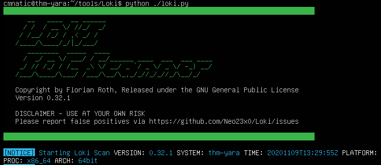
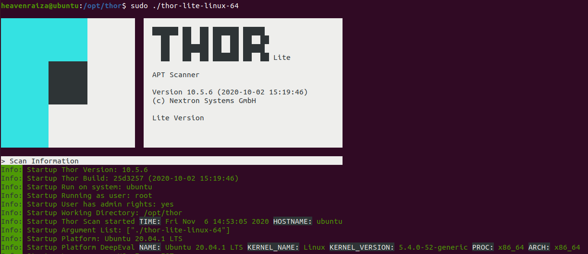
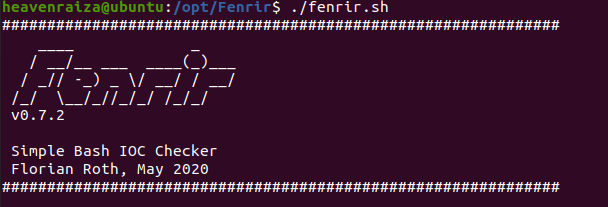
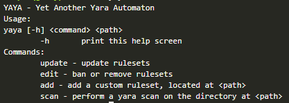

# Yara

"The pattern matching swiss knife for malware researchers (and everyone else)" (Virustotal., 2020)

Avec une citation aussi appropriée, Yara peut identifier des informations sur la base de modèles binaires et textuels, tels que les chaînes hexadécimales et les chaînes de caractères contenues dans un fichier.

Des règles sont utilisées pour étiqueter ces modèles. Par exemple, les règles de Yara sont souvent écrites pour déterminer si un fichier est malveillant ou non, sur la base des caractéristiques - ou modèles - qu'il présente.

Les chaînes de caractères sont un composant fondamental des langages de programmation. Les applications utilisent les chaînes de caractères pour stocker des données telles que du texte.

Une règle Yara pourrait être écrite pour rechercher au sein d'un fichier la présence de la chaine de caractères "Hello World".

**Pourquoi les malwares utilisent des chaines de caractères?**

La présence de chaines de caractères dans les malwares est utilisée pour les relier au hackers qui les envoient.

Exemple:

* Adresse Bitcoin Wallet
* Adresse IP pour un reverse shell
* ...

Ces paramètres sont utilisés comme Indicateur de compromission (IOC).

## Règles Yara

Le langage utilisé pour les règles Yara est simple à comprendre mais difficile à maitriser.
Un example de règle est la suivante:

```javascript
rule examplerule{
  condition: true
}
```
Cette règle vérifie simplement is le fichier/répertoire/PID spécifié en entrée existe.

Si le fichier:

      user@host: yara firstrule.yar testfile
      examplerule testfile

sinon:

      user@host: yara firstrule.yar testFile
      error scanning testFile.txt: could not open file


Il existe plusieurs conditions qui peuvent aider à construire ces règles Yara:

| Conditions &nbsp;&nbsp;&nbsp;&nbsp;&nbsp;|
|:--:|
|Keyword|
|Desc|
|Meta|
|Strings|
|Conditions|
|Weight|

### Meta

Cette section d'une règle Yara est réservée aux informations descriptives de l'auteur de la règle. Par exemple, vous pouvez utiliser `desc`, abréviation de description, pour résumer ce que votre règle vérifie. Tout ce qui se trouve dans cette section n'influence pas la règle elle-même. Comme pour le commentaire de code, il est utile de résumer votre règle.

### Strings

Vous vous souvenez de notre discussion sur les chaînes de caractères dans la tâche 2 ? Eh bien, nous y revoilà. Vous pouvez utiliser les chaînes de caractères pour rechercher un texte spécifique ou des caractères hexadécimaux dans des fichiers ou des programmes. Par exemple, si nous voulions rechercher dans un répertoire tous les fichiers contenant " Hello World !

```javascript
rule helloworld_checker{
  strings:
    $hello_world = "Hello World!"
}
```

Nous définissons le mot-clé `Strings` où la chaîne que nous voulons rechercher, c'est-à-dire "Hello World !" est stockée dans la variable `$hello_world`

Bien sûr, nous avons besoin d'une condition ici pour que la règle soit valide. Dans cet exemple, pour faire de cette chaîne la condition, nous devons utiliser le nom de la variable. Dans ce cas, `$hello_world` :

```javascript
rule helloworld_checker{
  strings:
    $hello_world = "Hello World!"

  condition:
    $hello_world
}
```

Cependant cette règle ne va matcher uniquement pour "Hello World!" et est sensible à la classe.

On peut créer plusieurs conditions à appliquer:

```javascript
rule helloworld_checker {
  strings:
    $hello_world = "Hello World!"
    $hello_world_lowercase = "hello world"
    $hello_world_uppercase = "HELLO WORLD"

  condition:
    any of them
}
```

N'importe quel fichier avec une chaine de caractère correspondant activera la règle.

### Conditions

Comme en programmation, il existe des opérateurs pour ces règles : `<=`,`>=`,`!=`

```javacript
rule helloworld_checker {
  strings:
    $hello_world = "Hello World!"

  condition:
    $hello_world <= 10
}
```

Dans ce cas, la règle va s'activer si il existe au maximum 10 occurence de "Hello World!" dans un fichier.

Il est aussi possible d'utiliser des mot-clés comme `and`,`or`,`not`.

```javacript
rule helloworld_checker {
  strings:
    $hello_world = "Hello World!"
    $txt_file = ".txt"

  condition:
    $hello_world and $txt_file
}
```

## Modules Yara

### Cuckoo

Cuckoo Sandbox est un environnement d'analyse automatique des logiciels malveillants. Ce module vous permet de générer des règles Yara basées sur les comportements découverts dans Cuckoo Sandbox. Comme cet environnement exécute des logiciels malveillants, vous pouvez créer des règles sur des comportements spécifiques tels que les chaînes d'exécution, etc.

### Python PE

Le module PE de Python vous permet de créer des règles Yara à partir des différentes sections et éléments de la structure PE (Portable Executable) de Windows.

Expliquer cette structure est hors de propos car elle est couverte dans la [salle d'introduction aux logiciels malveillants](https://tryhackme.com/room/malmalintroductory). Cependant, cette structure est le formatage standard de tous les exécutables et fichiers DLL sous Windows. Y compris les bibliothèques de programmation qui sont utilisées.

L'examen du contenu d'un fichier PE est une technique essentielle dans l'analyse des logiciels malveillants, car des comportements tels que la cryptographie ou les vers peuvent être largement identifiés sans rétro-ingénierie ou exécution de l'échantillon.

## Outil Yara

Il est utile de savoir comment créer des règles Yara personnalisées, mais heureusement, vous n'avez pas besoin de créer de nombreuses règles à partir de zéro pour commencer à utiliser Yara pour rechercher le mal. Il existe de nombreuses ressources GitHub et des outils open source (ainsi que des produits commerciaux) qui peuvent être utilisés pour exploiter Yara dans le cadre d'opérations de recherche et/ou de réponses aux incidents.

LOKI (qu'est-ce que Loki, et non qui, est ?)

LOKI est un scanner IOC (Indicator of Compromise) open source gratuit créé/écrit par Florian Roth.

D'après la page GitHub, la détection est basée sur 4 méthodes :

* Vérification de l'IOC par nom de fichier
* Vérification de la règle Yara (nous sommes ici)
*  Vérification du hachage
*  Vérification de la connexion arrière C2

Il existe d'autres vérifications pour lesquelles LOKI peut être utilisé. Pour un récapitulatif complet, veuillez vous référer au readme de GitHub.

LOKI peut être utilisé sur les systèmes Windows et Linux. Les utilisateurs de Windows peuvent télécharger le fichier binaire ([ici](https://github.com/Neo23x0/Loki/releases)), qui fonctionnera sur les systèmes 32 et 64 bits. Les utilisateurs de Linux peuvent utiliser le même lien pour télécharger LOKI.



---

THOR (programme au nom de super-héros pour un super-héros de l'équipe bleue)

THOR Lite est le tout nouveau scanner multiplateforme IOC et YARA de Florian Roth. Il existe des versions précompilées pour Windows, Linux et macOS. Une fonctionnalité intéressante de THOR Lite est l'étranglement du scan pour limiter l'épuisement des ressources du processeur. Pour plus d'informations et/ou pour télécharger le binaire, commencez [ici](https://www.nextron-systems.com/thor-lite/). Vous devez vous inscrire à leur liste de diffusion pour obtenir une copie du binaire. Notez que THOR est destiné aux entreprises. THOR Lite est la version gratuite.



---

FENRIR (convention de dénomination encore à thème mythique)

Ceci est le 3ème outil créé par Neo23x0 (Florian Roth). Vous l'avez deviné, les 2 précédents sont nommés ci-dessus. La version mise à jour a été créée pour résoudre le problème de ses prédécesseurs, où les exigences doivent être remplies pour qu'ils fonctionnent. Fenrir est un script bash ; il fonctionnera sur tout système capable d'exécuter bash (aujourd'hui même Windows).



---

YAYA (Yet Another Yara Automaton)

YAYA a été créé par l'EFF (Electronic Frontier Foundation) et publié en septembre 2020. D'après leur site Web, "YAYA est un nouvel outil open-source pour aider les chercheurs à gérer plusieurs référentiels de règles YARA. YAYA commence par importer un ensemble de règles YARA de haute qualité, puis permet aux chercheurs d'ajouter leurs propres règles, de désactiver des ensembles de règles spécifiques et d'exécuter des analyses de fichiers."

Note : Actuellement, YAYA ne fonctionne que sur les systèmes Linux.



## LOKI

En tant qu'analyste de sécurité, vous pouvez être amené à rechercher divers rapports de renseignement sur les menaces, des articles de blog, etc. et à recueillir des informations sur les dernières tactiques et techniques utilisées dans la nature, passées ou présentes. Généralement, dans ces lectures, les CIO (hachages, adresses IP, noms de domaine, etc.) seront partagés afin que des règles puissent être créées pour détecter ces menaces dans votre environnement, ainsi que des règles Yara. D'un autre côté, vous pouvez vous trouver dans une situation où vous avez rencontré quelque chose d'inconnu, que votre pile d'outils de sécurité ne peut pas ou n'a pas détecté. En utilisant des outils tels que Loki, vous devrez ajouter vos propres règles sur la base de vos renseignements sur les menaces ou des résultats d'une intervention en cas d'incident (médecine légale).

Comme nous l'avons déjà mentionné, Loki dispose déjà d'un ensemble de règles Yara dont nous pouvons tirer parti pour commencer immédiatement à rechercher le mal sur le point de terminaison.

Avant de commencer à l'utiliser, il est préférrable de mettre à jour la base des règle YARA utilisées pour la détection.

      user@host: python loki.py --update

Loki contient de nombreux arguments disponible ci-dessous.
```bash
user@host:~$ python loki.py -h
usage: loki.py [-h] [-p path] [-s kilobyte] [-l log-file] [-r remote-loghost]
               [-t remote-syslog-port] [-a alert-level] [-w warning-level]
               [-n notice-level] [--printall] [--allreasons] [--noprocscan]
               [--nofilescan] [--nolevcheck] [--scriptanalysis] [--rootkit]
               [--noindicator] [--reginfs] [--dontwait] [--intense] [--csv]
               [--onlyrelevant] [--nolog] [--update] [--debug]
               [--maxworkingset MAXWORKINGSET] [--syslogtcp]
               [--logfolder log-folder] [--nopesieve] [--pesieveshellc]
               [--nolisten] [--excludeprocess EXCLUDEPROCESS]

Loki - Simple IOC Scanner

optional arguments:
  -h, --help            show this help message and exit
  -p path               Path to scan
  -s kilobyte           Maximum file size to check in KB (default 5000 KB)
  -l log-file           Log file
  -r remote-loghost     Remote syslog system
  -t remote-syslog-port
                        Remote syslog port
  -a alert-level        Alert score
  -w warning-level      Warning score
  -n notice-level       Notice score
  --printall            Print all files that are scanned
  --allreasons          Print all reasons that caused the score
  --noprocscan          Skip the process scan
  --nofilescan          Skip the file scan
  --nolevcheck          Skip the Levenshtein distance check
  --scriptanalysis      Activate script analysis (beta)
  --rootkit             Skip the rootkit check
  --noindicator         Do not show a progress indicator
  --reginfs             Do check for Regin virtual file system
  --dontwait            Do not wait on exit
  --intense             Intense scan mode (also scan unknown file types and
                        all extensions)
  --csv                 Write CSV log format to STDOUT (machine processing)
  --onlyrelevant        Only print warnings or alerts
  --nolog               Don\'t write a local log file
  --update              Update the signatures from the "signature-base" sub
                        repository
  --debug               Debug output
  --maxworkingset MAXWORKINGSET
                        Maximum working set size of processes to scan (in MB,
                        default 100 MB)
  --syslogtcp           Use TCP instead of UDP for syslog logging
  --logfolder log-folder
                        Folder to use for logging when log file is not
                        specified
  --nopesieve           Do not perform pe-sieve scans
  --pesieveshellc       Perform pe-sieve shellcode scan
  --nolisten            Dot not show listening connections
  --excludeprocess EXCLUDEPROCESS
                        Specify an executable name to exclude from scans, can
                        be used multiple times
```

Pour analyser un fichier ou un répertoire, on utilise l'option `-p`. Ci dessous, un exemple d'un fichier php détecté étant un webshell.

      user@host: python loki.py -p <path>
      ...
      [WARNING]
      FILE: suspicious-files/file1/ind3x.php SCORE: 70 TYPE: PHP SIZE: 80992
      FIRST_BYTES: 3c3f7068700a2f2a0a09623337346b20322e320a / <?php/*b374k 2.2
      MD5: 1606bdac2cb613bf0b8a22690364fbc5
      SHA1: 9383ed4ee7df17193f7a034c3190ecabc9000f9f
      SHA256: 5479f8cd1375364770df36e5a18262480a8f9d311e8eedb2c2390ecb233852ad CREATED: Mon Nov  9 15:15:32 2020 MODIFIED: Mon Nov  9 13:06:56 2020 ACCESSED: Sat Oct  2 19:04:39 2021
      REASON_1: Yara Rule MATCH: webshell_metaslsoft SUBSCORE: 70
      DESCRIPTION: Web Shell - file metaslsoft.php REF: -
      MATCHES: Str1: $buff .= "<tr><td><a href=\\"?d=".$pwd."\\">[ $folder ]</a></td><td>LINK</t
      [NOTICE] Results: 0 alerts, 1 warnings, 7 notices
      [RESULT] Suspicious objects detected!
      [RESULT] Loki recommends a deeper analysis of the suspicious objects.
      ...

## Création de règle Yara

Les règles Yara sont basé sur des regex il est possible que certains fichier malicieux soient scannés sans être détectés. Pour cela, il est possible d'écrire des règles Yara avec [yarGen](https://github.com/Neo23x0/yarGen).

De même que pour Loki, il est nécessaire de mettre à jour la base avant de s'en servir.

      user@host: python3 yarGen.py --update

Son utilisation est simple:

      user@host: python3 yarGen.py -m <suspicious-file-path> --excludegood -o <output-yara-path>

* `-m`: Chemin du fichier pour lequel on veut créer une règle yara
* `--excludegood`: Force yarGen d'exclure les chaine de caractère légitime à un logiciel ce qui purrait créer des faux positifs.
* `-o`: Chemin du fichier contenant la règle yara


## Valhalla


VALHALLA a pour but de renforcer vos capacités de détection grâce à la puissance de milliers de règles YARA de haute qualité créées à la main.
