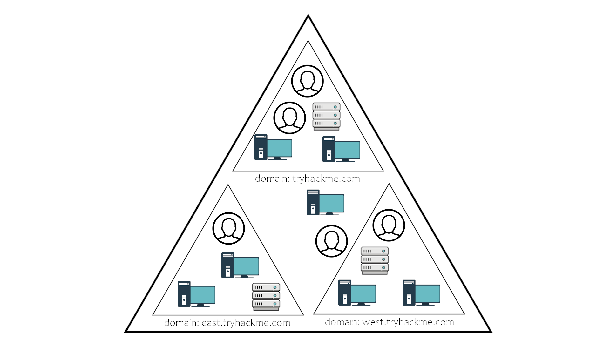
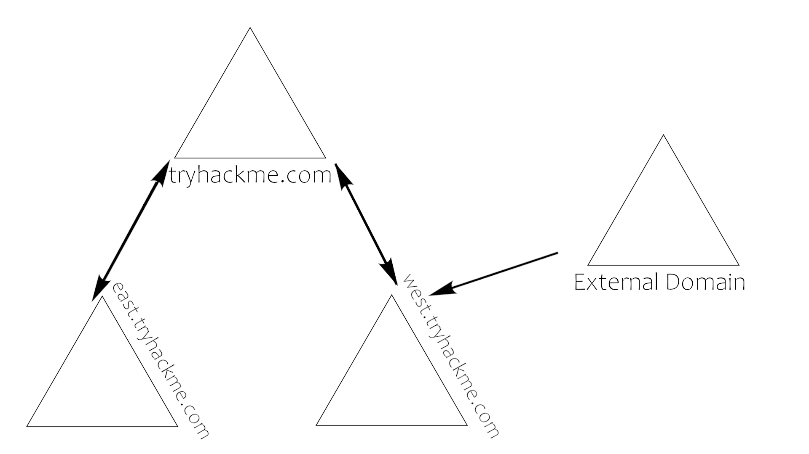
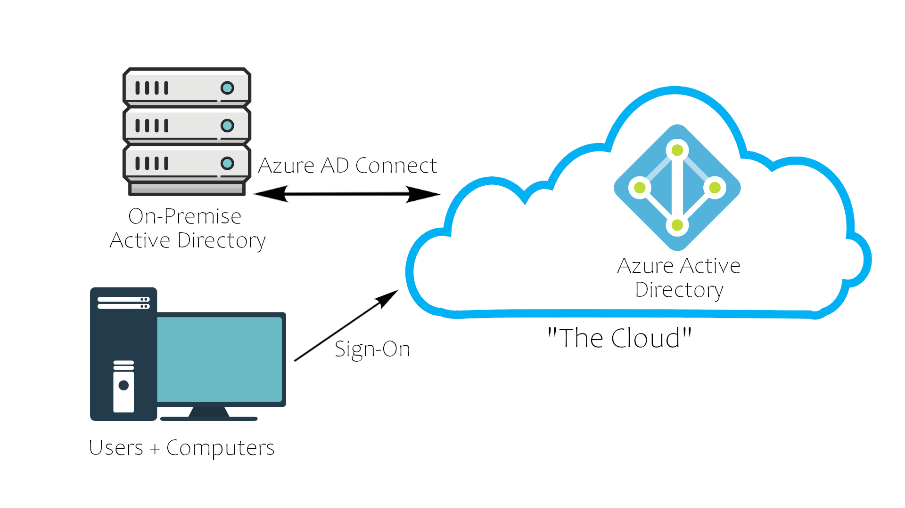

# Active Directory

## Active Directory: Qu'est ce que c'est ?

Active Directory est une collection de machines et de serveurs connectés à l'intérieur de domaines, qui sont une partie collective d'une plus grande forêt de domaines, qui constituent le réseau Active Directory. Active Directory contient de nombreux éléments fonctionnels, dont la majorité sera traitée dans les tâches à venir. Pour avoir un aperçu de ce que nous allons couvrir, jetez un coup d'œil à cette liste de composants Active Directory et familiarisez-vous avec les différentes pièces d'Active Directory :

* Contrôleurs de domaine
* Forêts, Arbres, Domaines
* Utilisateurs et groupes
* Trusts
* Politiques
* Services de domaine

Toutes ces parties d'Active Directory s'assemblent pour former un grand réseau de machines et de serveurs. Maintenant que nous savons ce qu'est Active Directory, parlons du pourquoi ?

## Pourquoi utiliser Active Directory ?

La majorité des grandes entreprises utilisent Active Directory car il permet de contrôler et de surveiller les ordinateurs de leurs utilisateurs par le biais d'un contrôleur de domaine unique. Il permet à un utilisateur unique de se connecter à n'importe quel ordinateur du réseau Active Directory et d'avoir accès à ses fichiers et dossiers stockés sur le serveur, ainsi qu'au stockage local de cette machine. Cela permet à tout utilisateur de l'entreprise d'utiliser n'importe quelle machine appartenant à l'entreprise, sans avoir à configurer plusieurs utilisateurs sur une machine. Active Directory fait tout cela pour vous.

## Active Directory Physique

L'Active Directory physique est constitué des serveurs et des machines sur place, il peut s'agir de n'importe quoi, des contrôleurs de domaine et des serveurs de stockage aux machines des utilisateurs du domaine ; tout ce qui est nécessaire pour un environnement Active Directory, à part le logiciel.

### Contrôleurs de domaine

Un contrôleur de domaine est un serveur Windows sur lequel sont installés les services de domaine Active Directory (AD DS) et qui a été promu contrôleur de domaine dans la forêt. Les contrôleurs de domaine sont le centre d'Active Directory - ils contrôlent le reste du domaine. Je vais décrire ci-dessous les tâches d'un contrôleur de domaine :

* Détient le magasin de données AD DS
* Gère les services d'authentification et d'autorisation
* Réplique les mises à jour des autres contrôleurs de domaine de la forêt
* Permet l'accès de l'administrateur pour gérer les ressources du domaine

### Magasin de données AD DS

L'Active Directory Data Store contient les bases de données et les processus nécessaires pour stocker et gérer les informations de l'annuaire telles que les utilisateurs, les groupes et les services. Vous trouverez ci-dessous un aperçu de certains contenus et caractéristiques de l'AD DS Data Store :

* Contient le NTDS.dit - une base de données qui contient toutes les informations d'un contrôleur de domaine Active Directory ainsi que les hashs des mots de passe des utilisateurs du domaine.
* Stocké par défaut dans %SystemRoot%\NTDS
* Accessible uniquement par le contrôleur de domaine

## Forêt

La forêt est ce qui définit tout ; c'est le conteneur qui maintient ensemble tous les autres éléments du réseau - sans la forêt, tous les autres arbres et domaines ne seraient pas en mesure d'interagir. Il est important de ne pas penser à la forêt de manière trop littérale, car il s'agit d'un élément physique autant que figuratif. Lorsque nous parlons de "forêt", il s'agit uniquement d'une façon de décrire la connexion créée entre ces arbres et domaines par le réseau.

Une forêt est un ensemble d'une ou plusieurs arborescences de domaines à l'intérieur d'un réseau Active Directory. C'est ce qui permet de catégoriser les parties du réseau dans son ensemble.

La forêt est constituée de ces parties que nous détaillerons plus tard :

* **Arbres** : Une hiérarchie de domaines dans les services de domaine Active Directory.
* **Domaines** : Utilisés pour regrouper et gérer des objets
* **Unités organisationnelles (OUs)** - Containers pour les groupes, les ordinateurs, les utilisateurs, les imprimantes et autres OUs.
* **Trusts** : Permet aux utilisateurs d'accéder aux ressources d'autres domaines.
* **Objets** : Utilisateurs, groupes, imprimantes, ordinateurs, partages
* **Services de domaine** : Serveur DNS, LLMNR, IPv6
* **Schéma du domaine** : Règles de création des objets

## Utilisateurs et Groupes

Les utilisateurs et les groupes qui se trouvent à l'intérieur d'un Active Directory sont libre de création. Lorsque vous créez un contrôleur de domaine, il est livré avec des groupes et deux utilisateurs par défaut : Administrateur et Invité. C'est à vous de créer de nouveaux utilisateurs et de créer de nouveaux groupes pour y ajouter des utilisateurs.

### Aperçu des utilisateurs

Les utilisateurs sont au cœur d'Active Directory ; sans eux, pourquoi avoir un Active Directory ? Il y a quatre principaux types d'utilisateurs que vous trouverez dans un réseau Active Directory ; cependant, il peut y en avoir plus selon la façon dont une entreprise gère les permissions de ses utilisateurs. Les quatre types d'utilisateurs sont les suivants :

* **Administrateurs de domaine** : C'est le grand patron : ils contrôlent les domaines et sont les seuls à avoir accès au contrôleur de domaine.
* **Comptes de service (peuvent être des administrateurs de domaine)** : Ils ne sont pour la plupart jamais utilisés, sauf pour la maintenance des services, ils sont requis par Windows pour des services tels que SQL pour associer un service à un compte de service.
* **Administrateurs locaux** : Ces utilisateurs peuvent apporter des modifications aux machines locales en tant qu'administrateur et peuvent même être en mesure de contrôler d'autres utilisateurs normaux, mais ils ne peuvent pas accéder au contrôleur de domaine.

* **Utilisateurs de domaine** : Ce sont vos utilisateurs quotidiens. Ils peuvent se connecter sur les machines auxquelles ils ont l'autorisation d'accéder et peuvent avoir des droits d'administrateur local sur les machines selon l'organisation.

### Aperçu des groupes

Les groupes facilitent l'attribution de permissions aux utilisateurs et aux objets en les organisant en groupes avec des permissions spécifiques. Il existe deux grands types de groupes Active Directory :

* **Groupes de sécurité** : Ces groupes sont utilisés pour spécifier les autorisations d'un grand nombre d'utilisateurs.

* **Groupes de distribution** : Ces groupes sont utilisés pour spécifier les listes de distribution de courrier électronique. En tant qu'attaquant, ces groupes sont moins avantageux pour nous, mais peuvent néanmoins être utiles pour l'énumération.

### Groupes de sécurité par défaut

Il y a beaucoup de groupes de sécurité par défaut, donc je ne vais pas entrer dans les détails de chacun d'entre eux, mais seulement dans une brève description des permissions qu'ils offrent au groupe assigné. Voici un bref aperçu des groupes de sécurité :

* **Contrôleurs de domaine** : Tous les contrôleurs de domaine du domaine.
* **Domain Guests** : Tous les invités du domaine
* **Utilisateurs du domaine** : Tous les utilisateurs du domaine
* **Ordinateurs du domaine** : toutes les stations de travail et tous les serveurs joints au domaine.
* **Admins du domaine** : Administrateurs désignés du domaine.
* **Enterprise Admins** : Administrateurs désignés de l'entreprise.
* **Schema Admins** : Administrateurs désignés du schéma.
* **DNS Admins** : Groupe d'administrateurs DNS
* **DNS Update Proxy** : Clients DNS qui sont autorisés à effectuer des mises à jour dynamiques pour le compte d'autres clients (tels que les serveurs DHCP).
* **Allowed RODC Password Replication Group** : Les membres de ce groupe peuvent voir leurs mots de passe répliqués sur tous les contrôleurs de domaine en lecture seule du domaine.
* **Propriétaires du créateur de stratégie de groupe** : Les membres de ce groupe peuvent modifier la stratégie de groupe pour le domaine.
* **Denied RODC Password Replication Group** : les membres de ce groupe ne peuvent pas faire répliquer leurs mots de passe sur les contrôleurs de domaine en lecture seule du domaine.
* **Protected Users** : Les membres de ce groupe bénéficient de protections supplémentaires contre les menaces de sécurité liées à l'authentification. Voir http://go.microsoft.com/fwlink/?LinkId=298939 pour plus d'informations.
* **Cert Publishers** : Les membres de ce groupe sont autorisés à publier des certificats dans l'annuaire.
* **Contrôleurs de domaine en lecture seule** : les membres de ce groupe sont des contrôleurs de domaine en lecture seule dans le domaine.
* **Enterprise Read-Only Domain Controllers** : Les membres de ce groupe sont des contrôleurs de domaine en lecture seule dans l'entreprise.
* **Key Admins** : Les membres de ce groupe peuvent effectuer des actions administratives sur les objets clés du domaine.
* **Enterprise Key Admins** : Les membres de ce groupe peuvent effectuer des actions administratives sur des objets clés dans la forêt.
* **Contrôleurs de domaine clonables** : les membres de ce groupe qui sont des contrôleurs de domaine peuvent être clonés.

* **Serveurs RAS et IAS** : les serveurs de ce groupe peuvent accéder aux propriétés d'accès à distance des utilisateurs.

## Trusts + Politiques

Les trusts et les politiques vont de pair pour aider le domaine et les arbres à communiquer entre eux et à maintenir la "sécurité" au sein du réseau. Elles mettent en place les règles qui régissent la manière dont les domaines d'une forêt peuvent interagir entre eux, la manière dont une forêt externe peut interagir avec la forêt, et les règles ou politiques générales qu'un domaine doit suivre.

### Aperçu des trusts de domaine

Les trusts sont un mécanisme mis en place pour que les utilisateurs du réseau puissent accéder à d'autres ressources du domaine. Dans la plupart des cas, les trusts définissent la manière dont les domaines d'une forêt communiquent entre eux. Dans certains environnements, les trusts peuvent être étendus à des domaines externes, voire à des forêts.

Il existe deux types de trusts qui déterminent la manière dont les domaines communiquent entre eux. Je vais décrire ces deux types de confiance ci-dessous :

* **Directionnel** : La direction de la confiance va d'un domaine de confiance à un domaine de confiance.
* **Transitive** : La relation de confiance s'étend au-delà de deux domaines pour inclure d'autres domaines de confiance.

Le type de confiance mis en place détermine la façon dont les domaines et les arbres d'une forêt sont capables de communiquer et d'envoyer des données entre eux. En attaquant un environnement Active Directory, il est parfois possible d'abuser de ces relations de confiance afin de se déplacer latéralement dans le réseau.

### Aperçu des politiques de domaine

Les stratégies sont une partie très importante d'Active Directory, elles dictent la façon dont le serveur fonctionne et les règles qu'il suivra ou non. Vous pouvez considérer les politiques de domaine comme des groupes de domaine, sauf qu'au lieu de permissions, elles contiennent des règles, et au lieu de s'appliquer uniquement à un groupe d'utilisateurs, les politiques s'appliquent à un domaine dans son ensemble. Elles agissent simplement comme un livre de règles pour Active Directory qu'un administrateur de domaine peut modifier et changer comme il le juge nécessaire pour assurer le bon fonctionnement et la sécurité du réseau. Outre la très longue liste de stratégies de domaine par défaut, les administrateurs de domaine peuvent choisir d'ajouter leurs propres stratégies qui ne sont pas déjà présentes sur le contrôleur de domaine. Par exemple, si vous souhaitez désactiver Windows Defender sur toutes les machines du domaine, vous pouvez créer un nouvel objet de stratégie de groupe pour désactiver Windows Defender. Les options pour les stratégies de domaine sont presque infinies et constituent un facteur important pour les attaquants lors de l'énumération d'un réseau Active Directory. Je vais vous présenter quelques-unes des nombreuses stratégies par défaut ou que vous pouvez créer dans un environnement Active Directory :

* **Disable Windows Defender** : Désactive Windows Defender sur toutes les machines du domaine.
* **Digitally Sign Communication (Always)** : Peut désactiver ou activer la signature SMB sur le contrôleur de domaine.

## Service de domaine

Les services de domaine sont exactement ce à quoi ils ressemblent. Il s'agit de services que le contrôleur de domaine fournit au reste du domaine ou de l'arborescence. Il existe un large éventail de services divers qui peuvent être ajoutés à un contrôleur de domaine ; cependant, dans cette salle, nous allons seulement passer en revue les services par défaut qui sont fournis lorsque vous configurez un serveur Windows comme contrôleur de domaine. Les services de domaine par défaut sont décrits ci-dessous :

* **LDAP** : Lightweight Directory Access Protocol ; assure la communication entre les applications et les services d'annuaire.
* **Certificate Services** : permet au contrôleur de domaine de créer, valider et révoquer des certificats de clé publique
* **DNS, LLMNR, NBT-NS** : Services de noms de domaine pour l'identification des noms d'hôtes IP.

## Authentification de domaine

La partie la plus importante d'Active Directory - ainsi que la plus vulnérable - est constituée par les protocoles d'authentification mis en place. Il y a deux principaux types d'authentification en place pour Active Directory : `NTLM` et `Kerberos`.

* **Kerberos** : Le service d'authentification par défaut d'Active Directory utilise des tickets de distribution et des tickets de service pour authentifier les utilisateurs et leur donner accès à d'autres ressources dans le domaine.
* **NTLM** : Le protocole d'authentification par défaut de Windows utilise un protocole crypté de type défi/réponse.

Les services de domaine Active Directory sont le principal point d'accès des attaquants et contiennent certains des protocoles les plus vulnérables pour Active Directory. Ce n'est pas la dernière fois que vous les verrez mentionnés en termes de sécurité Active Directory.

## Active Directory dans le Cloud

Récemment, une évolution de l'Active Directory a poussé les entreprises à se tourner vers les réseaux en nuage. Le fournisseur AD en nuage le plus notable est Azure AD. Ses paramètres par défaut sont beaucoup plus sûrs que ceux d'un réseau Active Directory physique sur site ; toutefois, l'AD en cloud peut encore présenter des vulnérabilités.

### Aperçu d'Azure AD

Azure agit comme un intermédiaire entre votre Active Directory physique et l'ouverture de session de vos utilisateurs. Cela permet une transaction plus sûre entre les domaines, rendant inefficaces de nombreuses attaques de l'Active Directory.

## Sécurité Cloud

La meilleure façon de vous montrer comment le cloud prend des précautions de sécurité au-delà de ce qui est déjà prévu avec un réseau physique est de vous montrer une comparaison avec un environnement Active Directory cloud :

|Windows Server AD | Azure AD|
|-|-|
|LDAP | REST API|
|NTLM | OAuth/SAML|
|Kerberos | OpenID|
|OU Tree | Flat Structure|
|Domaines et forêts | Tenants|
|Trusts | Invités |

Il ne s'agit que d'une vue d'ensemble d'Active Directory dans le nuage et nous n'entrerons donc pas dans le détail de ces protocoles. Je vous encourage toutefois à faire vos propres recherches sur ces protocoles dans le nuage et à vous demander s'ils sont plus sûrs que leurs équivalents physiques et s'ils présentent eux-mêmes des vulnérabilités.

## Commandes Powershell

Les commandes suivantes peuvent être utiles pour récupérer des informations sur un Active Directory depuis un Powershell.

:warning: Cependant, pour exécuter le script PowerShell sur le système, la politique d'exécution doit être définie sur Bypass `powershell -ep bypass`. Ensuite, il faut importer les modules du script PowerView `. .\PowerView.ps1` ou `Ìmport-Module .\PowerView.ps1`.
PowerView est module qui va permettre d'énumérer sur les domaines de l'Active Directory avec des commandes PowerShell.

##### Machines connectés au domaine: `Get-NetComputer`

      PS C:\Users\Administrator> Get-NetComputer -fulldata

      logoncount                    : 7
      badpasswordtime               : 12/31/1600 4:00:00 PM
      distinguishedname             : CN=DESKTOP-1,CN=Computers,DC=CONTROLLER,DC=local
      objectclass                   : {top, person, organizationalPerson, user...}
      badpwdcount                   : 0
      lastlogontimestamp            : 5/14/2020 12:25:53 PM
      objectsid                     : S-1-5-21-849420856-2351964222-986696166-1110
      samaccountname                : DESKTOP-1$
      localpolicyflags              : 0
      codepage                      : 0
      samaccounttype                : 805306369
      whenchanged                   : 5/14/2020 7:26:53 PM
      countrycode                   : 0
      cn                            : DESKTOP-1
      accountexpires                : 9223372036854775807
      adspath                       : LDAP://CN=DESKTOP-1,CN=Computers,DC=CONTROLLER,DC=local
      instancetype                  : 4
      usncreated                    : 20549
      objectguid                    : 260ac494-585f-4ae4-884e-1acf1ff7d55f
      operatingsystem               : Windows 10 Enterprise Evaluation
      operatingsystemversion        : 10.0 (18363)
      lastlogoff                    : 12/31/1600 4:00:00 PM
      objectcategory                : CN=Computer,CN=Schema,CN=Configuration,DC=CONTROLLER,DC=local
      dscorepropagationdata         : 1/1/1601 12:00:00 AM
      serviceprincipalname          : {RestrictedKrbHost/DESKTOP-1, HOST/DESKTOP-1,
                                      RestrictedKrbHost/Desktop-1.CONTROLLER.local, HOST/Desktop-1.CONTROLLER.local}        
      lastlogon                     : 5/14/2020 12:27:04 PM
      iscriticalsystemobject        : False
      usnchanged                    : 20563
      useraccountcontrol            : 4096
      whencreated                   : 5/14/2020 7:25:52 PM
      primarygroupid                : 515
      pwdlastset                    : 5/14/2020 12:25:52 PM
      msds-supportedencryptiontypes : 28
      name                          : DESKTOP-1
      dnshostname                   : Desktop-1.CONTROLLER.local

      ...

  Il est possible de filtrer ce résultat pour sélectionner un ou plusieurs arguments comme le système d'exploitation:

      PS C:\Users\Administrator> Get-NetComputer -fulldata | select operatingsystem

      operatingsystem
      ---------------
      Windows Server 2019 Standard
      Windows 10 Enterprise Evaluation
      Windows 10 Enterprise Evaluation

##### Utilisateurs actifs sur le réseau: `Get-NetUser`

      PS C:\Users\Administrator> Get-NetUser

      logoncount            : 0
      badpasswordtime       : 12/31/1600 4:00:00 PM
      distinguishedname     : CN=sshd,CN=Users,DC=CONTROLLER,DC=local
      objectclass           : {top, person, organizationalPerson, user}
      displayname           : sshd
      name                  : sshd
      objectsid             : S-1-5-21-849420856-2351964222-986696166-1111
      samaccountname        : sshd
      codepage              : 0
      samaccounttype        : 805306368
      whenchanged           : 5/15/2020 3:31:40 AM
      accountexpires        : 9223372036854775807
      countrycode           : 0
      adspath               : LDAP://CN=sshd,CN=Users,DC=CONTROLLER,DC=local
      instancetype          : 4
      usncreated            : 24609
      objectguid            : e1c0ef9b-0de9-48ba-9f91-9fbe45ddc0c6
      lastlogoff            : 12/31/1600 4:00:00 PM
      objectcategory        : CN=Person,CN=Schema,CN=Configuration,DC=CONTROLLER,DC=local
      dscorepropagationdata : 1/1/1601 12:00:00 AM
      lastlogon             : 12/31/1600 4:00:00 PM
      badpwdcount           : 0
      cn                    : sshd
      useraccountcontrol    : 66048
      whencreated           : 5/15/2020 3:31:40 AM
      primarygroupid        : 513
      pwdlastset            : 5/14/2020 8:31:40 PM
      usnchanged            : 24612

  Tout comme Get-NetComputer, on peut obtenir la date de la dernière modification du mot de passe de chaque utilisateur:

        PS C:\Users\Administrator> Get-NetComputer -fulldata | select displayname,pwdlastset

        displayname         pwdlastset
        -----------         ----------
                            10/3/2020 9:19:21 AM
                            12/31/1600 4:00:00 PM
                            5/13/2020 8:14:47 PM
        Machine-1           5/13/2020 8:23:01 PM
        Admin2              5/13/2020 8:24:43 PM
        Machine-2           5/13/2020 8:25:39 PM
        SQL Service         5/13/2020 8:26:58 PM
        POST{P0W3RV13W_FTW} 5/13/2020 8:42:38 PM
        sshd                5/14/2020 8:31:40 PM

##### Groupes disponibles sur le réseau `Get-NetGroup`

      PS C:\Users\Administrator> Get-NetGroup

      Administrators
      Users
      Guests
      Print Operators
      Backup Operators
      Replicator
      Remote Desktop Users
      Network Configuration Operators
      Performance Monitor Users
      Performance Log Users
      Distributed COM Users
      IIS_IUSRS
      Cryptographic Operators
      Event Log Readers
      Certificate Service DCOM Access
      RDS Remote Access Servers
      RDS Endpoint Servers
      RDS Management Servers
      Hyper-V Administrators
      Access Control Assistance Operators
      Remote Management Users
      Storage Replica Administrators
      Domain Computers
      Domain Controllers
      Schema Admins
      Enterprise Admins
      Cert Publishers
      Domain Admins
      Domain Users
      Domain Guests
      Group Policy Creator Owners
      RAS and IAS Servers
      Server Operators
      Account Operators
      Pre-Windows 2000 Compatible Access
      Incoming Forest Trust Builders
      Windows Authorization Access Group
      Terminal Server License Servers
      Allowed RODC Password Replication Group
      Denied RODC Password Replication Group
      Read-only Domain Controllers
      Enterprise Read-only Domain Controllers
      Cloneable Domain Controllers
      Protected Users
      Key Admins
      Enterprise Key Admins
      DnsAdmins
      DnsUpdateProxy

On peut aussi vouloir récupérer uniquement les groupes d'un seul utilisateur

      PS C:\Users\Administrator> Get-NetGroup -UserName Admin2

      BUILTIN\Administrators
      CONTROLLER\Denied RODC Password Replication Group
      CONTROLLER\Enterprise Admins
      CONTROLLER\Schema Admins
      CONTROLLER\Domain Admins
      CONTROLLER\Group Policy Creator Owners
