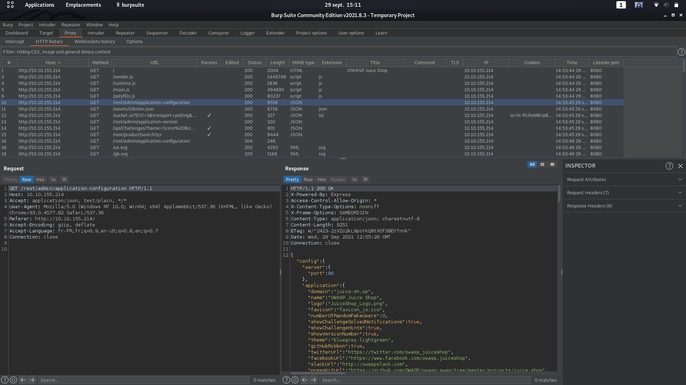
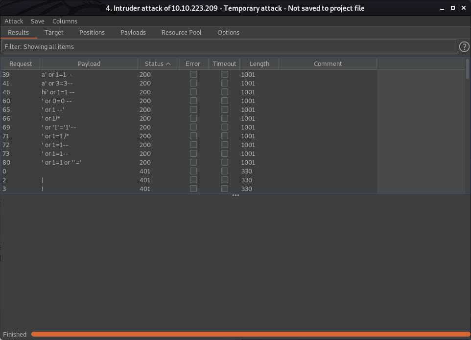

# Burpsuite

Burp Suite, un ensemble d'outils de pentesting d'applications web, est largement considéré comme l'outil de facto à utiliser pour effectuer des tests d'applications web. Tout au long de cette pièce, nous examinerons les bases de l'installation et de l'utilisation de cet outil ainsi que ses différents composants majeurs. Des liens de référence vers la documentation associée à chaque section ont été fournis au bas de la plupart des tâches de cette salle.

Les sections basiques qui composent Burp sont les suivantes:

* **Proxy** : Ce qui nous permet de canaliser le trafic à travers Burp Suite pour une analyse plus approfondie.
* **Cible** : Comment nous définissons la portée de notre projet. Nous pouvons également l'utiliser pour créer efficacement un plan du site de l'application que nous testons.
* **Intruder** : Outil incroyablement puissant pour tout ce qui concerne le fuzzing de terrain, le bourrage de crédence et plus encore.
* **Repeater** : Permet de "répéter" des demandes qui ont déjà été faites avec ou sans modification. Souvent utilisé comme étape préliminaire au fuzzing avec l'Intruder susmentionné.
* **Sequencer** : Analyse le caractère "aléatoire" présent dans des parties de l'application web qui sont censées être imprévisibles. Il est généralement utilisé pour tester les cookies de session.
* **Decoder** : Comme son nom l'indique, Decoder est un outil qui nous permet d'effectuer diverses transformations sur des éléments de données. Ces transformations vont du décodage/encodage à diverses bases ou à l'encodage d'URL.
* **Comparer** : Comparer, comme vous l'avez peut-être deviné, est un outil que nous pouvons utiliser pour comparer différentes réponses ou d'autres éléments de données tels que des cartes de site ou des historiques de proxy (génial pour tester les problèmes de contrôle d'accès). Il est très similaire à l'outil diff de Linux.
* **Extender** : Semblable à l'ajout de mods à un jeu comme Minecraft, Extender nous permet d'ajouter des composants tels que des intégrations d'outils, des définitions de scan supplémentaires, et plus encore !
* **Scanner** : Scanner automatisé de vulnérabilité web qui peut mettre en évidence des zones de l'application pour une enquête manuelle plus approfondie ou une exploitation possible avec une autre section de Burp. Cette fonctionnalité, bien qu'elle ne soit pas dans l'édition communautaire de Burp Suite, est toujours une facette clé de l'exécution d'un test d'application web.

## Proxy

D'une manière générale, les serveurs proxy nous permettent, par définition, de relayer notre trafic par une autre route vers l'internet. Cela peut être fait pour une variété de raisons allant du filtrage éducatif (commun dans les écoles où le contenu restreint doit être bloqué) à l'accès au contenu qui peut être autrement indisponible en raison du verrouillage de la région ou d'une interdiction. L'utilisation d'un proxy, cependant, pour le test d'applications web nous permet de voir et de modifier le trafic en ligne à un niveau granulaire. Tout au long de cette tâche, nous allons explorer les principaux composants du proxy Burp, notamment l'interception, l'historique des requêtes et les différentes options de configuration auxquelles nous avons accès.

Par défaut au lancement, Burp sera en mode `Interception` dans la section `Proxy`. Ce mode implique certaine choses:

1. Les demandes nécessiteront par défaut une autorisation de l'utilisateur pour être envoyées.

2. Nous pouvons modifier nos demandes en ligne, comme dans le cas d'une attaque de type "man-in-the-middle", puis les envoyer.

3. Nous pouvons également abandonner les demandes que nous ne voulons pas envoyer. Cela peut être utile pour voir la tentative de requête après avoir cliqué sur un bouton ou effectué une autre action sur le site Web.

4. Enfin, nous pouvons envoyer ces demandes à d'autres outils tels que Repeater et Intruder pour les modifier et les manipuler afin de créer des vulnérabilités.

Exemple de requête interceptée:

L'onglet `HTTP History` liste toutes les requêtes qui sont passées par le proxy, et donc Burp, cela même si l'interception n'est pas allumé.

L'onglet `WebSocket` va lister les échanges se faisant par un protocole de communication à faible latence qui ne nécéssite pas d'encapsultation HTTP.

L'onglet `Options` va permettre de modifier les paramètres de Burp Suite comme l'adresse du proxy ou encore le comportement dans l'interception des requêtes.

:bulb: Tips:
* `CTRL-R`: Envoie la requête dans le Repeater
* `CTRL-I`: Envoie la requête dans l'Intruder

## Target

L'onglet Target de Burp nous permet d'effectuer certaines des parties les plus importantes d'un test de pénétration d'une application web : définir notre champ d'application, visualiser un plan du site, et spécifier nos définitions de problèmes (bien que cela soit plus utile dans la génération de rapports et l'analyse).

Lorsque vous démarrez un test d'application web, on vous fournira très probablement quelques éléments :

* L'URL de l'application (si possible pour dev/test et non prod)
*  Une liste des différents rôles d'utilisateur dans l'application
* Les différents comptes de test et les informations d'identification associées à ces comptes.
* Une liste des éléments/formulaires de l'application qui sont hors de portée des tests et doivent être évités.

À partir de ces informations, nous pouvons maintenant commencer à construire notre champ d'application dans Burp, ce qui est extrêmement important dans le cas où nous prévoyons d'effectuer des tests automatisés. En général, cela se fait selon une approche par paliers dans laquelle nous remontons à partir du compte privilégié le plus bas (ce qui inclut l'accès non authentifié), en naviguant sur le site comme le ferait un utilisateur normal. Ce type de navigation, qui permet de découvrir toute l'étendue du site, est communément appelé "happy path". Après avoir créé un plan du site en parcourant le chemin heureux, nous pouvons commencer à supprimer divers éléments du périmètre. Ces éléments répondent généralement à l'un des critères suivants :

* L'élément (page, formulaire, etc.) a été désigné comme hors du champ d'application dans la documentation fournie par le client.
* L'exploitation automatisée de l'élément (en particulier d'une manière accréditée) causerait un énorme désordre (comme l'envoi de centaines d'e-mails de réinitialisation de mot de passe - Si vous avez fait une application web professionnellement, vous l'avez probablement fait à un moment donné).
* L'exploitation automatisée de l'élément (en particulier d'une manière accréditée) pourrait endommager et potentiellement faire planter l'application web.

Une fois que nous avons retiré de notre champ d'application tous les éléments restreints ou potentiellement dangereux, nous pouvons passer à d'autres domaines de test avec les différents outils de Burp Suite.

## Repeater

Le Repeater nous permet de répéter des requêtes que nous avons déjà faites. Ces demandes peuvent être réémises telles quelles ou avec des modifications. Contrairement à Intruder, Repeater est généralement utilisé à des fins d'expérimentation ou d'exploitation plus fine où l'automatisation n'est pas forcément souhaitée.
Ce mode va nous permettre de modifier et d'envoyer une requête (par le bouton `Send`) sans avoir besoin de constamment passer par le proxy.
L'example ci-dessous permet de tester une page login et on peut remarquer qu'un simple injection SQL nous permet d'obtenir un accès administrateur.

## Intruder

Intruder peut être utilisé pour de nombreuses choses allant du fuzzing au brute-forcing. Au fond, Intruder a un seul objectif : l'automatisation.

Alors que Repeater est le mieux adapté à l'expérimentation ou aux tests ponctuels, Intruder est destiné aux tests répétés une fois qu'une preuve de concept a été établie. Selon la documentation de Burp Suite, voici quelques utilisations courantes :

* L'énumération d'identifiants tels que les noms d'utilisateur, le passage en revue de token de session/de récupération de mot de passe prévisibles et la tentative de deviner un mot de passe simple.

* Récolte de données utiles à partir de profils d'utilisateurs ou d'autres pages d'intérêt via l'extraction de nos réponses.

* Recherche de vulnérabilités telles que l'injection SQL, le cross-site scripting (XSS) et le path traversal.

Pour réaliser ces différents cas d'utilisation, Intruder dispose de quatre types d'attaque différents :

1. **Sniper** : Le type d'attaque le plus populaire, qui passe en revue les positions sélectionnées, en plaçant la prochaine charge utile disponible (élément de notre liste de mots) dans chaque position à tour de rôle. Il n'utilise qu'un seul ensemble de charges utiles (une seule liste de mots).

2. **Battering Ram** : Comme le sniper, le Bettering Ram n'utilise qu'un seul ensemble de charges utiles. Contrairement à Sniper, Battering Ram place chaque charge utile dans chaque position sélectionnée. Pensez à la façon dont un bélier fait contact sur une grande surface avec une seule surface, d'où le nom de bélier pour ce type d'attaque.

3. **Pitchfork** : Le type d'attaque Pitchfork nous permet d'utiliser plusieurs ensembles de charges utiles (un par position sélectionnée) et d'itérer sur les deux ensembles de charges utiles simultanément. Par exemple, si nous avons sélectionné deux positions (disons un champ de nom d'utilisateur et un champ de mot de passe), nous pouvons fournir une liste de charges utiles de nom d'utilisateur et de mot de passe. Intruder passera ensuite en revue les combinaisons de noms d'utilisateur et de mots de passe, pour aboutir à un nombre total de combinaisons égal au plus petit ensemble de données utiles fourni.

4. **Cluster Bomb** : Le type d'attaque Cluster Bomb nous permet d'utiliser plusieurs ensembles de charges utiles (un par position sélectionnée) et d'itérer à travers toutes les combinaisons des listes de charges utiles que nous fournissons. Par exemple, si nous avons sélectionné deux positions (disons un champ de nom d'utilisateur et un champ de mot de passe), nous pouvons fournir une liste de charges utiles de nom d'utilisateur et de mot de passe. Intruder passera ensuite en revue les combinaisons de noms d'utilisateur et de mots de passe, pour aboutir à un nombre total de combinaisons égal à noms d'utilisateur x mots de passe. Notez que cela peut devenir assez long si vous utilisez l'édition communautaire de Burp.

Ci-dessous, un example d'utilisation d'Intruder. On peut remarquer que l'attaque sélectionnée est `Sniper` et que la variable sur laquelle on va agir est l'email définie par `$<variableContent>$`.

Avant de commencer l'attaque, il faut définir les paramètres du Payload. Qu'elles sont les valeurs qui vont être testées. Les valeurs chargées dans proviennent de la [liste de détection de fuzz SQLi](https://github.com/fuzzdb-project/fuzzdb/blob/master/attack/sql-injection/detect/xplatform.txt). Il suffit de télécharger le fichier et de l'importer dans Burp depuis le bouton `Load`

On précise dans le cas d'une détection de faille SQL, il faut décocher l'option encodage URL des caractères pour qu'ils soient reconnus par la base de données.

## Sequencer

Sequencer représente un outil de base dans un pentest d'application web approprié. Le séquenceur de Burp est un outil pour analyser la qualité aléatoire dans les tokens de sessions d'une application et d'autres éléments de données importants qui sont autrement destinés à être imprévisibles. Les éléments couramment analysés sont les suivants

* Les tokens de session
* tokens anti-CSRF (Cross-Site Request Forgery)
* tokens de réinitialisation de mot de passe (envoyés avec les réinitialisations de mot de passe qui, en théorie, lient de manière unique les utilisateurs à leurs demandes de réinitialisation de mot de passe).

On peut avec cette fonction analyser un réponse qui créer un cookie pour l'utilisateur. En envoyant la requête à l'origine de cette création dans le Sequencer, on peut lancer une génération de plusieurs milliers de token pour détecter un schéma dans leur création.

L'image ci-dessous détail le résultat de l'analyse du cookie.

## Decoder & Comparer

Bien qu'étant des outils de moindre importance dans la suite Burp, il est essentiel de les comprendre et de les utiliser pour devenir un testeur d'applications Web compétent.

Comme son nom l'indique, Decoder est un outil qui nous permet d'effectuer diverses transformations sur des éléments de données. Ces transformations vont du décodage/encodage à diverses bases ou à l'encodage d'URL. Nous enchaînons ces transformations et Decoder génère automatiquement un niveau supplémentaire chaque fois que nous sélectionnons un décodeur, un encodeur ou un hachage.

De même, Comparer, comme vous l'avez peut-être deviné, est un outil que nous pouvons utiliser pour comparer différentes réponses ou d'autres éléments de données tels que des cartes de site ou des historiques de proxy (génial pour tester les problèmes de contrôle d'accès). Il est très similaire à l'outil diff de Linux.

Selon la documentation de Burp, certaines utilisations courantes de Comparer sont les suivantes :

* Lorsque vous recherchez des conditions d'énumération de nom d'utilisateur, vous pouvez comparer les réponses aux connexions échouées en utilisant des noms d'utilisateur valides et invalides, en recherchant des différences subtiles dans les réponses. Ceci est aussi parfois utile lors de l'énumération des formulaires de récupération de mot de passe ou d'un autre mécanisme similaire de récupération/accès au compte.

* Lorsqu'une attaque d'intrus a donné lieu à des réponses très volumineuses et de longueurs différentes de la réponse de base, vous pouvez les comparer pour voir rapidement où se situent les différences.

* Lorsque vous comparez les cartes de site ou les entrées de l'historique du proxy générées par différents types d'utilisateurs, vous pouvez comparer des paires de requêtes similaires pour voir où se situent les différences qui donnent lieu à un comportement différent des applications. Cela peut révéler d'éventuels problèmes de contrôle d'accès dans l'application, où des utilisateurs moins privilégiés peuvent accéder à des pages auxquelles ils ne devraient pas avoir accès.

* Lorsque vous testez les bogues d'injection SQL aveugle à l'aide de l'injection de conditions booléennes et d'autres tests similaires, vous pouvez comparer deux réponses pour voir si l'injection de conditions différentes a entraîné une différence pertinente dans les réponses.
