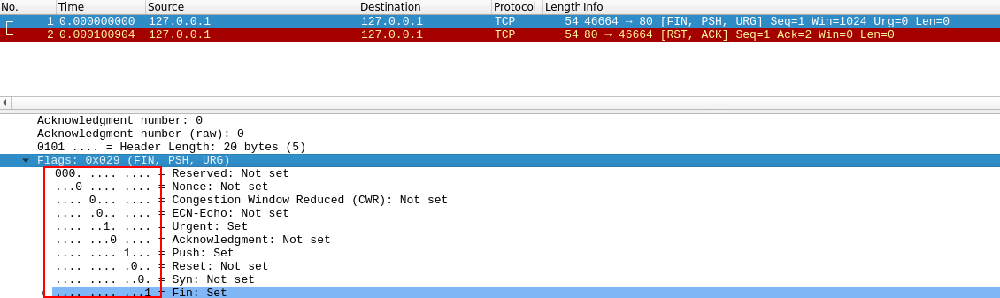

# Nmap

Une des premières actions à effectuer lors d'un test d'intrusion est de procéder a une énumération des machines disponibles sur un réseau et des ports qui sont accessibles.

La première étape pour établir cette "carte" du paysage est ce qu'on appelle le balayage des ports. Lorsqu'un ordinateur exécute un service réseau, il ouvre une structure réseau appelée "port" pour recevoir la connexion.  Les ports sont nécessaires pour effectuer plusieurs requêtes réseau ou pour disposer de plusieurs services. Par exemple, lorsque vous chargez plusieurs pages Web à la fois dans un navigateur Web, le programme doit avoir un moyen de déterminer quel onglet charge quelle page Web. Pour ce faire, il établit des connexions avec les serveurs Web distants en utilisant différents ports sur votre machine locale. De même, si vous souhaitez qu'un serveur soit capable d'exécuter plusieurs services (par exemple, si vous voulez que votre serveur Web exécute les versions HTTP et HTTPS du site), il vous faut un moyen de diriger le trafic vers le service approprié. Une fois encore, les ports sont la solution à ce problème. Les connexions réseau sont établies entre deux ports - un port ouvert qui écoute sur le serveur et un port sélectionné au hasard sur votre propre ordinateur. Par exemple, lorsque vous vous connectez à une page Web, votre ordinateur peut ouvrir le port 49534 pour se connecter au port 443 du serveur.

Chaque ordinateur dispose d'un total de 65535 ports disponibles ; toutefois, nombre d'entre eux sont enregistrés comme des ports standard. Par exemple, un service Web HTTP se trouve presque toujours sur le port 80 du serveur. Un service Web HTTPS se trouve sur le port 443. Windows NETBIOS se trouve sur le port 139 et SMB sur le port 445. Il est toutefois important de noter que, notamment dans le cadre d'une FFC, il n'est pas rare que même ces ports standard soient modifiés, ce qui rend encore plus impératif de procéder à une énumération appropriée de la cible.

Si nous ne savons pas lesquels de ces ports sont ouverts sur un serveur, nous n'avons aucun espoir d'attaquer la cible avec succès ; il est donc crucial de commencer toute attaque par une analyse des ports. Ceci peut être accompli de différentes manières - généralement à l'aide d'un outil appelé nmap, qui est l'objet de cette pièce. Nmap peut être utilisé pour effectuer de nombreux types de scan de port - les plus courants seront présentés dans les tâches suivantes ; cependant, la théorie de base est la suivante : nmap se connectera à chaque port de la cible tour à tour. Selon la façon dont le port répond, il peut être déterminé comme étant ouvert, fermé ou filtré (généralement par un pare-feu). Une fois que nous savons quels ports sont ouverts, nous pouvons alors chercher à énumérer les services qui s'exécutent sur chaque port - soit manuellement, soit plus communément en utilisant nmap.

Alors, pourquoi nmap ? La réponse courte est qu'il est actuellement la norme de l'industrie pour une raison : aucun autre outil de balayage de port ne s'approche de sa fonctionnalité (bien que certains nouveaux arrivants l'égalent maintenant en vitesse). Il s'agit d'un outil extrêmement puissant - rendu encore plus puissant par son moteur de script qui peut être utilisé pour rechercher des vulnérabilités et, dans certains cas, exécuter directement l'exploit ! Une fois encore, ce sujet sera abordé plus en détail dans les tâches à venir.

Pour l'instant, il est important que vous compreniez : ce qu'est l'analyse des ports, pourquoi elle est nécessaire et que nmap est l'outil de choix pour tout type d'énumération initiale.

Il existe 3 types de scans classiques:
* Scan Connexion TCP `-sT`
* Scan "Half-open" SYN `-sS`
* Scan UDP `-sU`

Les scans suivants sont moins utilisés mais peuvent être utile dans certain cas:
* Scan TCP NULL `-sN`
* Scan TCP FIN `-sF`
* Scan Xmas `-sX`

## Scan connexion TCP `-sT`

Pour comprendre ce type de scan, il est important de connaitre `three-way handshake` TCP.

Si le handshake réussi, cela signifie que la connexion entre le client et le serveur a été établie.

## Scan SYN `-sS`

Un scan SYN est appelé `Half-open` ou `Stealth`.

Tandis qu'un scan TCP va effectuer complètement le three-way handshake TCP, le scan SYN va renvoyer le paquet RST sur le dernier paquet. Ci-dessous représente l'échange de paquet entre le client et le serveur pour ce type de scan.

Ce scan présente certains avantages pour les hackers:
* Il peut être utilisé pour contourner les anciens systèmes de détection d'intrusion car ils recherchent une poignée de main à trois voies. Ce n'est souvent plus le cas avec les solutions IDS modernes ; c'est pour cette raison que les scans SYN sont encore fréquemment appelés scans "furtifs".

* Les scans SYN ne sont souvent pas enregistrés par les applications qui écoutent sur les ports ouverts, car la pratique standard est d'enregistrer une connexion une fois qu'elle a été entièrement établie. Encore une fois, cela fait partie de l'idée que les scans SYN sont furtifs.

* Sans avoir à se soucier de compléter (et de se déconnecter) une poignée de main à trois voies pour chaque port, les scans SYN sont significativement plus rapides qu'un scan TCP Connect standard.

Les analyses SYN présentent toutefois quelques inconvénients, à savoir :

* Ils nécessitent des autorisations sudo[1] afin de fonctionner correctement sous Linux. En effet, les scans SYN nécessitent la possibilité de créer des paquets bruts (par opposition à la poignée de main TCP complète), ce qui est un privilège que seul l'utilisateur root possède par défaut.

* Les services instables sont parfois mis hors service par les scans SYN, ce qui peut s'avérer problématique si un client a fourni un environnement de production pour le test.

## Scan UDP `-sU`

Contrairement au TCP, les connexions UDP sont sans état. Cela signifie que, plutôt que d'initier une connexion par une "poignée de main" en aller-retour, les connexions UDP se contentent d'envoyer des paquets à un port cible en espérant qu'ils y parviennent. Cela rend UDP superbe pour les connexions qui privilégient la vitesse à la qualité (par exemple, le partage de vidéos), mais l'absence d'accusé de réception rend UDP beaucoup plus difficile (et beaucoup plus lent) à scanner. Le commutateur pour un scan UDP de Nmap est (`-sU`)

Lorsqu'un paquet est envoyé à un port UDP ouvert, il ne devrait pas y avoir de réponse. Lorsque cela se produit, Nmap considère que le port est `ouvert|filtré`. En d'autres termes, il soupçonne que le port est ouvert, mais qu'il pourrait être protégé par un pare-feu. S'il obtient une réponse UDP (ce qui est très inhabituel), alors le port est marqué comme ouvert. Le plus souvent, il n'y a pas de réponse, auquel cas la requête est envoyée une deuxième fois pour vérifier. S'il n'y a toujours pas de réponse, le port est marqué comme ouvert|filtré et Nmap poursuit son chemin.

Lorsqu'un paquet est envoyé à un port UDP fermé, la cible devrait répondre par un paquet ICMP (ping) contenant un message indiquant que le port est inaccessible. Ceci identifie clairement les ports fermés, que Nmap marque comme tels et continue.

En raison de cette difficulté à identifier si un port UDP est réellement ouvert, les scans UDP ont tendance à être incroyablement lents en comparaison avec les différents scans TCP (environ 20 minutes pour scanner les 1000 premiers ports, avec une bonne connexion). Pour cette raison, c'est généralement une bonne pratique de lancer un scan Nmap avec `--top-ports <number>` activé. Par exemple, un scan avec `nmap -sU --top-ports 20 <target>`  . Scannera les 20 ports UDP les plus couramment utilisés, avec pour résultat un temps de scan beaucoup plus acceptable.

Lors du scan des ports UDP, Nmap envoie généralement des requêtes complètement vides - juste des paquets UDP bruts. Ceci dit, pour les ports qui sont généralement occupés par des services bien connus, il enverra plutôt une charge utile spécifique au protocole qui est plus susceptible de susciter une réponse à partir de laquelle un résultat plus précis peut être tiré.

## Scan NULL, FIN, Xmas

Les analyses des ports TCP NULL, FIN et Xmas sont moins utilisées que les autres que nous avons déjà abordées, nous n'allons donc pas entrer dans les détails ici. Les trois sont liés et sont utilisés principalement car ils ont tendance à être encore plus furtifs, relativement parlant, qu'un scan "stealth" SYN. Commençons par les scans NULL :

* Comme son nom l'indique, le balayage NULL (`-sN`) consiste à envoyer une requête TCP sans aucun drapeau. Selon la RFC, l'hôte cible doit répondre par un RST si le port est fermé.

* Les scans FIN (`-sF`) fonctionnent de manière presque identique ; cependant, au lieu d'envoyer un paquet complètement vide, une requête est envoyée avec le drapeau FIN (habituellement utilisé pour fermer gracieusement une connexion active). Une fois encore, Nmap attend un RST si le port est fermé.

* Comme les deux autres scans de cette classe, les scans Xmas (`-sX`) envoient un paquet TCP malformé et attendent une réponse RST pour les ports fermés. On l'appelle le scan Xmas car les drapeaux qu'il active (PSH, URG et FIN) lui donnent l'apparence d'un arbre de Noël clignotant lorsqu'il est visualisé sous forme de capture de paquets dans Wireshark.

## Scan réseau ICMP

Lors de la première connexion à un réseau cible dans une boîte noire, notre premier objectif est d'obtenir une "carte" de la structure du réseau -- ou, en d'autres termes, nous voulons voir quelles adresses IP contiennent des hôtes actifs, et lesquelles ne le sont pas.

Une façon d'y parvenir est d'utiliser Nmap pour effectuer ce qu'on appelle un "balayage ping". C'est exactement comme son nom l'indique : Nmap envoie un paquet ICMP à chaque adresse IP possible pour le réseau spécifié. Lorsqu'il reçoit une réponse, il marque l'adresse IP qui a répondu comme étant vivante. Pour des raisons que nous verrons dans une tâche ultérieure, ce n'est pas toujours précis ; cependant, cela peut fournir une base de référence et cela vaut donc la peine d'être couvert.

Pour effectuer un balayage ping, nous utilisons le commutateur `-sn` en conjonction avec des plages d'adresses IP qui peuvent être spécifiées avec un trait d'union (`-`) ou la notation CIDR. Par exemple, nous pourrions balayer le réseau `192.168.0.x` en utilisant

    nmap -sn 192.168.0.1-254
ou

    nmap -sn 192.168.0.0/24

Le paramètre `-sn` indique à Nmap de ne scanner aucun port le forçant à se reposer principalement sur les paquets d'écho ICMP (ou les requêtes ARP sur un réseau local, s'il est exécuté avec sudo ou directement en tant qu'utilisateur root) pour identifier les cibles. En plus des requêtes ICMP echo, le commutateur `-sn` fera également envoyer à Nmap un paquet TCP SYN au port 443 de la cible, ainsi qu'un paquet TCP ACK (ou TCP SYN s'il n'est pas exécuté en tant que root) au port 80 de la cible.

## Script NSE

Le **N**map **S**cripting **E**ngine (NSE) est un ajout incroyablement puissant à Nmap, étendant considérablement ses fonctionnalités. Les scripts NSE sont écrits dans le langage de programmation Lua, et peuvent être utilisés pour faire une variété de choses : de la recherche de vulnérabilités à l'automatisation de leur exploitation. Le NSE est particulièrement utile pour la reconnaissance, mais il est bon de garder à l'esprit l'étendue de la bibliothèque de scripts.

De nombreuses catégories sont disponibles. Voici quelques catégories utiles :

* `safe`:- N'affectera pas la cible
* `intrusif`:- Non sûr : susceptible d'affecter la cible
* `vuln`:- Recherche de vulnérabilités
* `exploit`:- Tentative d'exploitation d'une vulnérabilité
* `auth`:- Tentative de contournement de l'authentification pour les services en cours d'exécution (par exemple, connexion anonyme à un serveur FTP)
* `brute`:- Tentative de forcer les informations d'identification des services en cours d'exécution
* `discovery`:- Tentative d'interrogation des services en cours d'exécution pour obtenir des informations supplémentaires sur le réseau (par exemple, interrogation d'un serveur SNMP).

Une liste plus exhaustive peut être trouvée [ici](https://nmap.org/book/nse-usage.html).

Pour exécuter un script spécifique, nous utiliserons `--script=<nom-du-script>` , par exemple `--script=http-fileupload-exploiter`.

Plusieurs scripts peuvent être exécutés simultanément de cette manière en les séparant par une virgule. Par exemple : `--script=smb-enum-users,smb-enum-shares`.

Certains scripts nécessitent des arguments (par exemple, des informations d'identification, s'ils exploitent une vulnérabilité authentifiée). Ceux-ci peuvent être donnés avec l'option `--script-args` de Nmap. Un exemple de ceci est le script `http-put` (utilisé pour télécharger des fichiers en utilisant la méthode PUT). Il prend deux arguments : l'URL vers laquelle télécharger le fichier, et l'emplacement du fichier sur le disque.  Par exemple :

`nmap -p 80 --script http-put --script-args http-put.url='/dav/shell.php',http-put.file='./shell.php'`

Notez que les arguments sont séparés par des virgules, et reliés au script correspondant par des points (c'est-à-dire `<nom du script>.<argument>`).

Une liste complète des scripts et de leurs arguments correspondants (ainsi que des exemples d'utilisation) peut être trouvée [ici](https://nmap.org/nsedoc/).

Les scripts de Nmap sont livrés avec des menus d'aide intégrés, auxquels on peut accéder en utilisant `nmap --script-help <script-name>`. Cette aide n'est généralement pas aussi complète que celle du lien ci-dessus, mais elle peut néanmoins être utile lorsque vous travaillez localement.

### Recherche de script

Il existe deux options pour rechercher un script, qui devraient idéalement être utilisées en conjonction l'une avec l'autre. La première est la page du site web de Nmap (mentionnée dans la tâche précédente) qui contient une liste de tous les scripts officiels. La seconde est le stockage local sur votre machine d'attaque. Nmap stocke ses scripts sous Linux dans le répertoire `/usr/share/nmap/scripts`. Tous les scripts NSE sont stockés dans ce répertoire par défaut -- c'est là que Nmap recherche les scripts lorsque vous les spécifiez.

Il y a deux façons de rechercher les scripts installés. La première consiste à utiliser le fichier `/usr/share/nmap/scripts/script.db`. Malgré l'extension, ce n'est pas vraiment une base de données mais plutôt un fichier texte formaté contenant les noms de fichiers et les catégories pour chaque script disponible.

* Rechercher dans la base nmap avec une regex:
`grep "ftp" /usr/share/nmap/scripts/script.db`
* Rechercher dans le répertoire contenant les scripts!
`ls -l /usr/share/nmap/scripts/*ftp*`

### Installation d'un nouveau script

Nous avons mentionné précédemment que le site web de Nmap contient une liste de `scripts`, alors, que se passe-t-il si l'un d'entre eux manque dans le répertoire des scripts localement ? Un `sudo apt update standard && sudo apt install nmap` devrait résoudre ce problème ; cependant, il est également possible d'installer les scripts manuellement en téléchargeant le script depuis Nmap (`sudo wget -O /usr/share/nmap/scripts/<script-name>.nse https://svn.nmap.org/nmap/scripts/<script-name>.nse`). Ceci doit ensuite être suivi par `nmap --script-updatedb`, qui met à jour le fichier `script.db` pour qu'il contienne le nouveau script téléchargé.

## Firewall Evasion

Nous avons déjà vu certaines techniques de contournement des pare-feu (pensez aux scans furtifs, ainsi qu'aux scans NULL, FIN et Xmas) ; cependant, il existe une autre configuration de pare-feu très courante qu'il est impératif de savoir contourner.

Votre hôte Windows typique, avec son pare-feu par défaut, bloquera tous les paquets ICMP. Cela pose un problème : non seulement nous utilisons souvent le ping pour établir manuellement l'activité d'une cible, mais Nmap fait la même chose par défaut. Cela signifie que Nmap enregistrera un hôte avec cette configuration de pare-feu comme mort et ne prendra pas la peine de l'analyser du tout.

Nous avons donc besoin d'un moyen de contourner cette configuration. Heureusement, Nmap fournit une option pour cela : `-Pn`, qui indique à Nmap de ne pas prendre la peine d'envoyer un ping à l'hôte avant de le scanner. Cela signifie que Nmap traitera toujours le(s) hôte(s) cible(s) comme étant vivant(s), contournant ainsi le bloc ICMP ; cependant, cela peut prendre beaucoup de temps pour compléter le scan (si l'hôte est vraiment mort, Nmap continuera à vérifier et revérifier chaque port spécifié).

Il est intéressant de noter que si vous êtes déjà directement sur le réseau local, Nmap peut également utiliser les requêtes ARP pour déterminer l'activité de l'hôte.

Il existe une variété d'autres commutateurs que Nmap considère comme utiles pour l'évasion des pare-feu. Nous ne les examinerons pas en détail, mais vous pouvez les trouver [ici](https://nmap.org/book/man-bypass-firewalls-ids.html).

Les commutateurs suivants sont particulièrement intéressants :

* `-f`: Utilisé pour fragmenter les paquets (c.-à-d. les diviser en plus petits morceaux) rendant moins probable la détection des paquets par un pare-feu ou un IDS.
* Une alternative à `-f`, mais fournissant plus de contrôle sur la taille des paquets : `--mtu <number>`, accepte une taille maximale d'unité de transmission à utiliser pour les paquets envoyés. Cela doit être un multiple de 8.
* `--scan-delay <time>ms`: utilisé pour ajouter un délai entre les paquets envoyés. Ceci est très utile si le réseau est instable, mais aussi pour échapper aux déclencheurs de pare-feu/IDS basés sur le temps qui peuvent être en place.
* `--badsum`: ceci est utilisé pour générer une somme de contrôle invalide pour les paquets. Toute pile TCP/IP réelle abandonnerait ce paquet, mais les pare-feu peuvent potentiellement répondre automatiquement, sans prendre la peine de vérifier la somme de contrôle du paquet. En tant que tel, ce commutateur peut être utilisé pour déterminer la présence d'un pare-feu/IDS.

#### Félicitation vous êtes désormais un spécialiste Nmap!!! :sunglasses:
